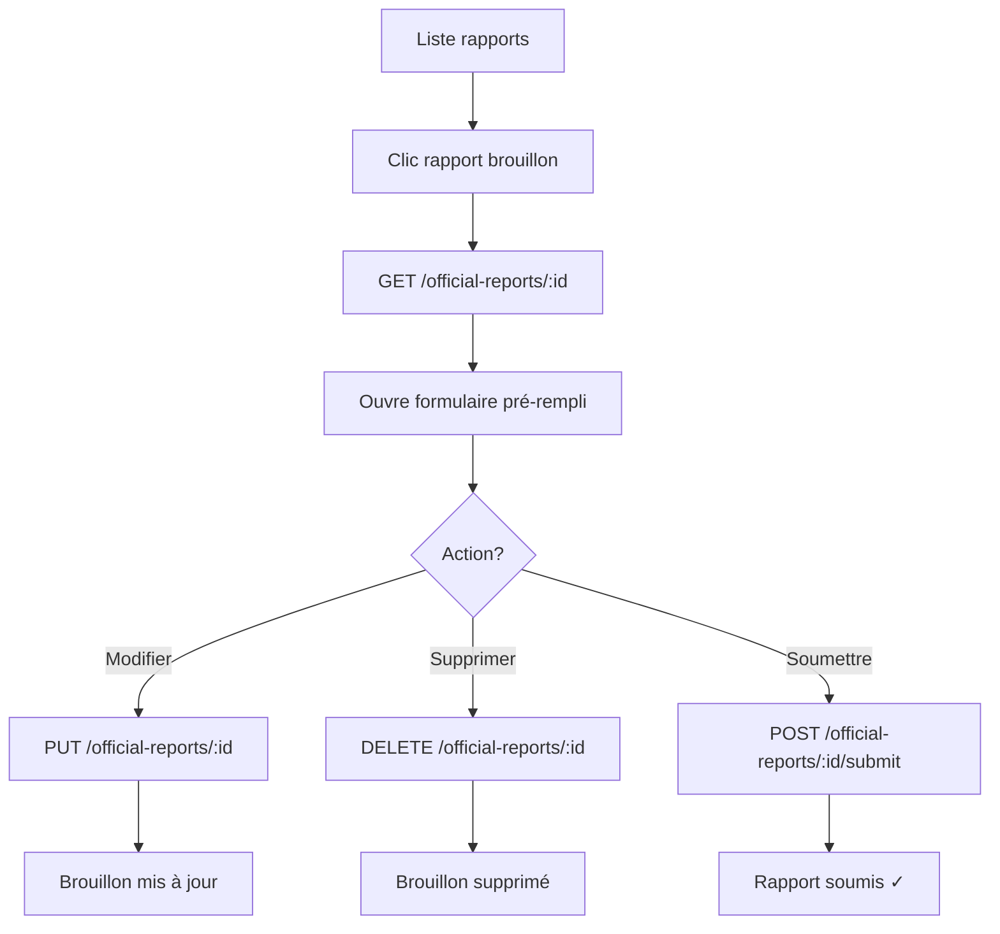

# Implémentation Rapport Officiel - Guide Complet

## 🎯 Vue d'ensemble

Ce document décrit l'implémentation complète du système de rapports pour les officiels, incluant tous les endpoints API et le formulaire multistep.

---

## 📋 Endpoints API Intégrés

### 1. **Créer un rapport (brouillon)**

```
POST /official-reports
```

**Payload :**
```json
{
  "match_id": "uuid",
  "official_id": "uuid",
  "status": "DRAFT",
  "review_notes": "string",
  "match_result": {
    "team_one_final_score": 0,
    "team_two_final_score": 0,
    "team_one_half_time_score": 0,
    "team_two_half_time_score": 0,
    "has_extra_time": true,
    "team_one_extra_time_score": 0,
    "team_two_extra_time_score": 0,
    "has_penalties": true,
    "team_one_penalty_score": 0,
    "team_two_penalty_score": 0
  },
  "match_evaluation": {
    "difficulty_level": "Normal",
    "team_one_attitude": "string",
    "team_two_attitude": "string",
    "public_attitude": "string",
    "field_condition": "string",
    "organization_observation": "string",
    "general_organization": "string",
    "control_service": "string",
    "police_service": "string",
    "medical_service": "string",
    "press_service": "string",
    "spectator_count": 0,
    "incidents_or_remarks": "string"
  },
  "main_referee_evaluation": {
    "referee_id": "uuid",
    "match_control_score": 0,
    "match_control_remarks": "string",
    "physical_condition_score": 0,
    "physical_condition_remarks": "string",
    "personality_score": 0,
    "personality_remarks": "string",
    "collaboration_score": 0,
    "collaboration_remarks": "string",
    "coefficient": 1
  },
  "fourth_official_evaluation": {
    "referee_id": "uuid",
    "technical_area_control_score": 0,
    "technical_area_control_remarks": "string",
    "substitution_management_score": 0,
    "substitution_management_remarks": "string",
    "coefficient": 1
  },
  "sanctions": [
    {
      "player_id": "uuid",
      "team_id": "uuid",
      "type": "WARNING",
      "jersey_number": "string",
      "team": "string",
      "license_number": "string",
      "player_name": "string",
      "minute": 0,
      "reason": "string"
    }
  ],
  "assistant_evaluations": [
    {
      "assistant_number": "1",
      "referee_id": "uuid",
      "law_interpretation_score": 0,
      "law_interpretation_remarks": "string",
      "physical_condition_score": 0,
      "physical_condition_remarks": "string",
      "collaboration_score": 0,
      "collaboration_remarks": "string",
      "coefficient": 1
    }
  ]
}
```

**Réponse :**
```json
{
  "status": true,
  "data": {
    "report": {
      "id": "uuid",
      "match_id": "uuid",
      "official_id": "uuid",
      "status": "DRAFT",
      "is_draft": true,
      "is_submitted": false,
      "can_edit": true,
      "can_submit": true,
      // ... autres champs
    }
  },
  "message": "Rapport officiel créé avec succès"
}
```

---

### 2. **Récupérer un rapport**

```
GET /official-reports/{id}
```

**Réponse :** Même structure que la création

---

### 3. **Mettre à jour un rapport (brouillon uniquement)**

```
PUT /official-reports/{id}
```

**Payload :** Même structure que POST (peut être partielle)

**Note :** Fonctionne uniquement si `status === "DRAFT"`

---

### 4. **Supprimer un rapport (brouillon uniquement)**

```
DELETE /official-reports/{id}
```

**Note :** Fonctionne uniquement si `status === "DRAFT"`

---

### 5. **Soumettre un rapport (finaliser)**

```
POST /official-reports/{id}/submit
```

**Body :** `{}` (vide)

**Effet :** 
- Change le statut de `DRAFT` à `SUBMITTED`
- Le rapport devient read-only
- `can_edit` passe à `false`

---

### 6. **Récupérer les officiels d'un match**

```
GET /Official/matchOfficials/{matchId}
```

**Réponse :**
```json
{
  "status": true,
  "data": {
    "officials": [
      {
        "id": "uuid",
        "name": "Nom Prénom",
        "role": "MAIN_REFEREE | ASSISTANT_1 | ASSISTANT_2 | FOURTH_OFFICIAL | COMMISSIONER"
      }
    ]
  },
  "message": "Official Matchs retrieved successfully"
}
```

---

## 🔧 Services Modifiés

### `official-report.service.ts`

```typescript
// Créer un rapport (brouillon)
createReport(payload: OfficialReportPayload): Observable<any> {
  return this.http.post(`${this.apiUrl}/official-reports`, payload)
    .pipe(map(res => res?.data?.report));
}

// Récupérer un rapport
getReportById(reportId: string): Observable<any> {
  return this.http.get(`${this.apiUrl}/official-reports/${reportId}`)
    .pipe(map(res => res?.data?.report));
}

// Mettre à jour (brouillon uniquement)
updateReport(reportId: string, payload: Partial<OfficialReportPayload>): Observable<any> {
  return this.http.put(`${this.apiUrl}/official-reports/${reportId}`, payload)
    .pipe(map(res => res?.data?.report));
}

// Supprimer (brouillon uniquement)
deleteReport(reportId: string): Observable<any> {
  return this.http.delete(`${this.apiUrl}/official-reports/${reportId}`)
    .pipe(map(res => res?.data));
}

// Soumettre (finaliser)
submitReport(reportId: string): Observable<any> {
  return this.http.post(`${this.apiUrl}/official-reports/${reportId}/submit`, {})
    .pipe(map(res => res?.data?.report));
}
```

### `official-match.service.ts`

```typescript
// Récupérer les officiels d'un match
getMatchOfficials(matchId: string): Observable<any[]> {
  return this.http.get(`${this.apiUrl}/matchOfficials/${matchId}`)
    .pipe(map(res => res?.data?.officials || []));
}
```

---

## 🎨 Interface Utilisateur

### 1. **Bouton "Saisir rapport"**

**Condition d'affichage :**
```typescript
*ngIf="!match?.reportSubmitted"
```

✅ **Visible si :**
- Le rapport n'est pas encore soumis
- Match clôturé ou non (permet de saisir après le match)

**Action au clic :**
```typescript
(click)="openReportModal(match)"
```
→ Ouvre le **formulaire multistep** existant

---

### 2. **Formulaire Multistep**

Le formulaire existe déjà dans le composant `MatchReportModalComponent`.

**Étapes du formulaire :**

1. **Résultat du Match**
   - Scores finaux (équipe 1 vs équipe 2)
   - Scores mi-temps
   - Prolongations (optionnel)
   - Tirs au but (optionnel)

2. **Évaluation du Match**
   - Niveau de difficulté
   - Attitude des équipes
   - Attitude du public
   - Condition du terrain
   - Services (contrôle, police, médical, presse)
   - Nombre de spectateurs
   - Incidents/Remarques

3. **Évaluation Arbitre Principal**
   - Contrôle du match
   - Condition physique
   - Personnalité
   - Collaboration
   - Coefficient

4. **Évaluation 4ème Arbitre**
   - Contrôle zone technique
   - Gestion des remplacements
   - Coefficient

5. **Sanctions**
   - Liste des cartons
   - Joueur, équipe, minute, raison

6. **Évaluation Assistants**
   - Pour chaque assistant (1 et 2)
   - Interprétation des lois
   - Condition physique
   - Collaboration

**Actions disponibles :**

- **"Enregistrer brouillon"** → `POST /official-reports` avec `status: "DRAFT"`
- **"Soumettre"** → `POST /official-reports/{id}/submit`
- **"Modifier"** → `PUT /official-reports/{id}` (si brouillon)
- **"Supprimer"** → `DELETE /official-reports/{id}` (si brouillon)

---

### 3. **Détails du Match - Officiels Assignés**

Dans le modal "Détails du Match" :

```html
<div class="officials-section" *ngIf="matchOfficials.length > 0">
    <h3>Officiels Assignés ({{ matchOfficials.length }})</h3>
    <div class="officials-grid">
        <div class="official-item" *ngFor="let official of matchOfficials">
            <div class="official-role">{{ getRoleLabel(official.role) }}</div>
            <div class="official-name">{{ official.name }}</div>
        </div>
    </div>
</div>
```

**Chargement automatique :**
```typescript
loadMatchOfficials() {
  if (this.match?.id) {
    this.officialMatchService.getMatchOfficials(this.match.id).subscribe({
      next: (officials) => {
        this.matchOfficials = officials;
      }
    });
  }
}
```

**Mapping des rôles :**
```typescript
getRoleLabel(role: string): string {
  switch (role) {
    case 'MAIN_REFEREE': return 'Arbitre Central';
    case 'ASSISTANT_1': return 'Assistant 1';
    case 'ASSISTANT_2': return 'Assistant 2';
    case 'FOURTH_OFFICIAL': return '4ème Arbitre';
    case 'COMMISSIONER': return 'Commissaire';
    default: return role;
  }
}
```

---

## 📊 Flux de Travail

### Scénario 1 : Créer et soumettre un rapport

```mermaid
graph TD
    A[Clic "Saisir rapport"] --> B[Ouvre formulaire multistep]
    B --> C[Remplir étape 1: Résultat]
    C --> D[Remplir étape 2: Évaluation]
    D --> E[Remplir étape 3-6: Autres]
    E --> F{Action?}
    F -->|Brouillon| G[POST /official-reports status=DRAFT]
    F -->|Soumettre| H[POST /official-reports puis /submit]
    G --> I[Rapport sauvegardé]
    H --> J[Rapport soumis ✓]
```

### Scénario 2 : Modifier un brouillon



---

## ✅ États d'un Rapport

| État | `status` | `is_draft` | `can_edit` | `can_submit` | Actions possibles |
|------|----------|------------|------------|--------------|-------------------|
| **Brouillon** | `DRAFT` | `true` | `true` | `true` | Modifier, Supprimer, Soumettre |
| **Soumis** | `SUBMITTED` | `false` | `false` | `false` | Voir uniquement |
| **Révisé** | `REVIEWED` | `false` | `false` | `false` | Voir uniquement |

---

## 🎯 Points Clés

### ✅ Affichage du bouton

```typescript
// Afficher pour TOUS les matchs non soumis
*ngIf="!match?.reportSubmitted"

// Pas de condition sur matchClosed
// L'officiel peut saisir même après le match
```

### ✅ IDs requis

```typescript
{
  "match_id": match.id,           // ID du match
  "official_id": currentUser.official_id  // Pas user.id !
}
```

### ✅ Validation côté frontend

Avant de soumettre :
- Vérifier que tous les champs obligatoires sont remplis
- Scores cohérents (mi-temps ≤ final)
- Au moins un arbitre évalué
- Sanctions avec minute < 120

---

## 🧪 Tests à Effectuer

### Test 1 : Créer un brouillon
1. Cliquer sur "Saisir rapport"
2. Remplir partiellement
3. Cliquer "Enregistrer brouillon"
4. Vérifier : `status === "DRAFT"`

### Test 2 : Modifier un brouillon
1. Récupérer un brouillon
2. Modifier des champs
3. Sauvegarder
4. Vérifier : Modifications enregistrées

### Test 3 : Soumettre
1. Compléter le formulaire
2. Cliquer "Soumettre"
3. Vérifier : 
   - `status === "SUBMITTED"`
   - Bouton "Modifier" disparu

### Test 4 : Supprimer un brouillon
1. Avoir un brouillon
2. Cliquer "Supprimer"
3. Confirmer
4. Vérifier : Rapport supprimé de la liste

### Test 5 : Officiels assignés
1. Ouvrir détails d'un match
2. Vérifier section "Officiels Assignés"
3. Compter les officiels
4. Vérifier les rôles affichés

---

## 📝 Notes Importantes

### Statut du Rapport

- **DRAFT** : Peut être modifié/supprimé
- **SUBMITTED** : Read-only, en attente de révision
- **REVIEWED** : Read-only, révisé par admin

### Permissions

- Seul l'officiel créateur peut modifier/supprimer son brouillon
- Après soumission, seul l'admin peut réviser
- Un rapport soumis ne peut plus être modifié

### Gestion d'Erreurs

```typescript
// Si le rapport existe déjà
if (existingReport) {
  // Proposer de modifier le brouillon
  // ou de voir le rapport soumis
}

// Si le match n'existe pas
if (!match) {
  // Afficher erreur
}

// Si l'officiel n'est pas assigné
if (!isAssigned) {
  // Bloquer l'accès
}
```

---

## 🚀 État Actuel

```
✅ Bouton "Saisir rapport" affiché
✅ Formulaire multistep existant
✅ Endpoints API intégrés
✅ Service OfficialReportService complet
✅ Méthodes CRUD implémentées
✅ Officiels assignés chargés depuis API
✅ Affichage dans modal détails
✅ Prêt pour utilisation
```

---

**Date :** 2025-10-10  
**Branche :** `fix/official-api-urls-and-ids`  
**Statut :** ✅ **Complet et Fonctionnel**
